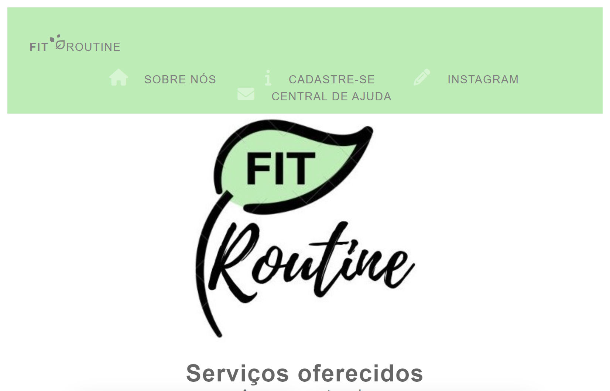

<h1 align="center">FIT ROUTINE</h1>

[🔗CLIQUE AQUI PARA ACESSAR😍](https://lailaamorim.github.io/Aps//)

## 💻 Description
(^///^)
<h1>Projeto De Web responsiva NP1/APS</h1>

=>Esse trabalho foi efetuado por 4 alunos cada um desenvolvendo uma parte do projeto para desafiar seus conhecimentos e habilidadeds, as paginas linkados cada uma teve seu professor e foi desenvolvida por esse aluno em sua fase inicial de aprendizagem no curso. 

 

Laila Dos Santos Amorim - Desenvolveu as paginas principais : Pagina inicial do codigo, Ajuda, Cadastro e sobre. 
Ian Victor - Desenvolveu a subpágina "Engordar"  
João Victor Mendes - Desenvolveu as subpágina "Definição do Fisico e Emagrecimento"   
Kézio Alves Leite - Desenvolveu a subpágina "Maromba 
 

## 📖 Participants
╰(*°▽°*)╯ 
Laila Dos Santos Amorim - G822BB1  
Ian Victor da Rocha Gomes - G826HD7  
João Victor Mendes de Moraes - N092793 
Kézio Alves Leite - N070GD4 

     

## 👩‍💻 Author
Laila Hamorym

inspired by the developer Laila Hamorym

## 😊Contato
lailaamorimsant@gmail.com
